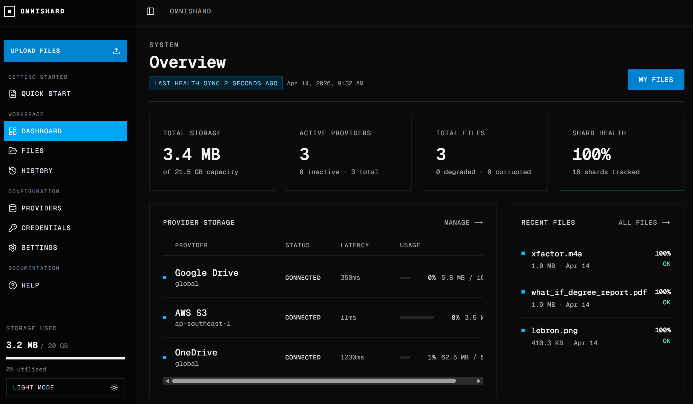

# CS464 Project | Omnishard


Omnishard is a distributed cloud storage platform that shards files with Reed-Solomon encoding, stores shard data across external cloud providers, tracks placement and lifecycle metadata, and reconstructs files from any viable shard subset during download.



The repository currently supports two backend implementations behind the same frontend product surface:

- `backend/microservice`: the split-service deployment with dedicated adapter, shardmap, sharding, orchestrator, and gateway services.
- `backend/monolith`: the standalone single-process backend that serves the same external workflows without an NGINX gateway.

## Backend Flavors

| Flavor | Runtime shape | Public ports | Best fit |
| --- | --- | --- | --- |
| Microservices | Separate frontend, adapter, shardmap, sharding, orchestrator, and gateway containers | `3000`, `8080`, `8081`, `8082`, `8083`, `8084` | Service-boundary debugging and multi-service development |
| Backend-only microservices | Adapter, shardmap, sharding, orchestrator, and gateway without the frontend | `8080`, `8081`, `8082`, `8083`, `8084` | Backend-only local development |
| All-in-one Microservices | Frontend plus one bundled `omnishard-all-in-one` image that runs the microservice stack internally | `3000`, `8080` | Pull-only deployment with microservice behavior |
| Monolith | Frontend plus one `omnishard-monolith` backend process | `3000`, `8080` | Simplified deployment and monolith-specific development |
| All-in-one Monolith | One bundled `omnishard-all-in-one-monolith` image that runs the monolith backend and frontend internally | `3000`, `8080` | Smallest pull-only deployment footprint |

## Run Omnishard

### Official GitHub OSS release assets

Use the GitHub Releases assets when you want a ready-to-run deployment without building images locally.

Microservices deployment:

```powershell
Invoke-WebRequest https://github.com/Vindyang/cs464-project/releases/latest/download/docker-compose.microservices.yml -OutFile docker-compose.yml
docker compose up -d
```

```bash
curl -L -o docker-compose.yml https://github.com/Vindyang/cs464-project/releases/latest/download/docker-compose.microservices.yml
docker compose up -d
```

All-in-one Microservices deployment:

```powershell
Invoke-WebRequest https://github.com/Vindyang/cs464-project/releases/latest/download/docker-compose.all-in-one-microservices.yml -OutFile docker-compose.yml
docker compose up -d
```

```bash
curl -L -o docker-compose.yml https://github.com/Vindyang/cs464-project/releases/latest/download/docker-compose.all-in-one-microservices.yml
docker compose up -d
```

Monolith deployment:

```powershell
Invoke-WebRequest https://github.com/Vindyang/cs464-project/releases/latest/download/docker-compose.monolith.yml -OutFile docker-compose.yml
docker compose up -d
```

```bash
curl -L -o docker-compose.yml https://github.com/Vindyang/cs464-project/releases/latest/download/docker-compose.monolith.yml
docker compose up -d
```

All-in-one monolith deployment:

```powershell
Invoke-WebRequest https://github.com/Vindyang/cs464-project/releases/latest/download/docker-compose.all-in-one-monolith.yml -OutFile docker-compose.yml
docker compose up -d
```

```bash
curl -L -o docker-compose.yml https://github.com/Vindyang/cs464-project/releases/latest/download/docker-compose.all-in-one-monolith.yml
docker compose up -d
```

Default endpoints by release flavor:

- Microservices: frontend `http://localhost:3000`, adapter `http://localhost:8080`, shardmap `http://localhost:8081`, orchestrator `http://localhost:8082`, sharding `http://localhost:8083`, gateway `http://localhost:8084`.
- All-in-one Microservices: frontend `http://localhost:3000`, bundled API surface `http://localhost:8080`.
- Monolith: frontend `http://localhost:3000`, monolith API surface `http://localhost:8080`.
- All-in-one Monolith: frontend `http://localhost:3000`, bundled monolith API surface `http://localhost:8080`.

Stop any downloaded release asset deployment with:

```powershell
docker compose down
```

### Local source-build workflows

Use the root `docker-compose.yml` when developing from the repository checkout.

Prerequisites:

- Go `1.25.0`
- Bun `1.x`
- Docker Desktop with the `docker compose` plugin

Microservices stack from source:

```powershell
docker compose --profile full up -d --build
```

Backend-only microservices stack from source:

```powershell
docker compose --profile backend up -d --build
```

Frontend plus monolith from source:

```powershell
docker compose --profile monolith up -d --build monolith frontend-monolith
```

Monolith backend only from source:

```powershell
docker compose --profile monolith up -d --build monolith
```

Default endpoints by local profile:

- `full`: frontend `http://localhost:3000`, adapter `http://localhost:8080`, shardmap `http://localhost:8081`, orchestrator `http://localhost:8082`, sharding `http://localhost:8083`, gateway `http://localhost:8084`.
- `backend`: adapter `http://localhost:8080`, shardmap `http://localhost:8081`, orchestrator `http://localhost:8082`, sharding `http://localhost:8083`, gateway `http://localhost:8084`.
- `monolith`: monolith API `http://localhost:8080`, and if `frontend-monolith` is started, frontend `http://localhost:3000`.

Stop local source-build stacks:

```powershell
docker compose --profile full down
docker compose --profile backend down
docker compose --profile monolith down
```

Reset persisted local data:

```powershell
docker compose --profile full down -v
docker compose --profile monolith down -v
```

### Repo-local GHCR pull manifests

Use the manifests under `deploy/compose/` when you want to pull published images from GHCR without downloading the official release asset first.

Set the registry namespace and tag:

```powershell
$env:IMAGE_NAMESPACE = "ghcr.io/vindyang"
$env:OMNISHARD_TAG = "<release-tag-or-commit-sha>"
```

Run the Microservices pull-only manifest:

```powershell
docker compose -f deploy/compose/microservices.yml up -d
```

Run the All-in-one Microservices pull-only manifest:

```powershell
docker compose -f deploy/compose/all-in-one-microservices.yml up -d
```

Run the monolith pull-only manifest:

```powershell
docker compose -f deploy/compose/monolith.yml up -d
```

Run the all-in-one monolith pull-only manifest:

```powershell
docker compose -f deploy/compose/all-in-one-monolith.yml up -d
```

## Documentation

Start with these references:

- [backend/microservice/README.md](backend/microservice/README.md) for the microservice backend layout, APIs, run modes, and test commands.
- [backend/monolith/README.md](backend/monolith/README.md) for the monolith backend layout, APIs, run modes, and test commands.
- [docs/architecture.md](docs/architecture.md) for the shared system architecture and a comparison of the two backend topologies.
- [docs/backend-microservice.md](docs/backend-microservice.md) for the deeper microservice architecture breakdown.
- [docs/backend-monolith.md](docs/backend-monolith.md) for the deeper monolith architecture breakdown.
- [docs/cicd.md](docs/cicd.md) for local validation, CI gates, publishing workflows, and release asset generation.
- [DEVDOCS.md](DEVDOCS.md) for contributor notes and operator setup details.
- [TODO.md](TODO.md) for the current project backlog.
